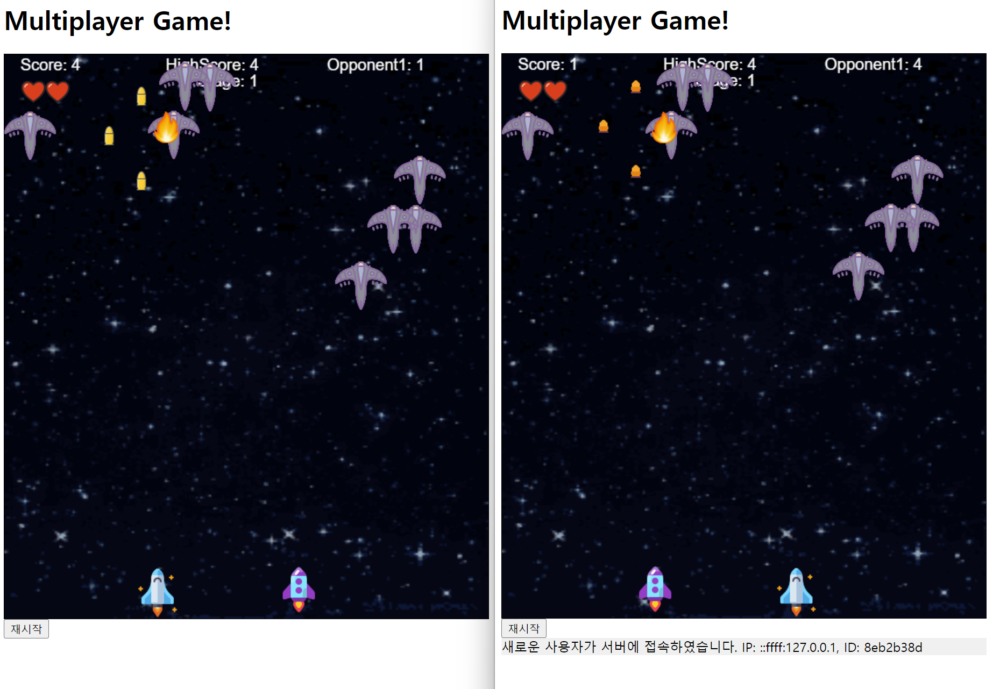

# Intro.
- This project is solely designed and developed by myself.
- Materials in this project is used for my lectuer and educational purposes.
- You cannot use this materials for commercial usage without my consent.

# Technology stack
- JavaScript, Canvas, WebSocket

# How to play
- Directional keys (or touch to move)
- Shoot with space (or shoot with touch)
- Press 'b' to use bomb (touch not supported)

# Reference Screen

